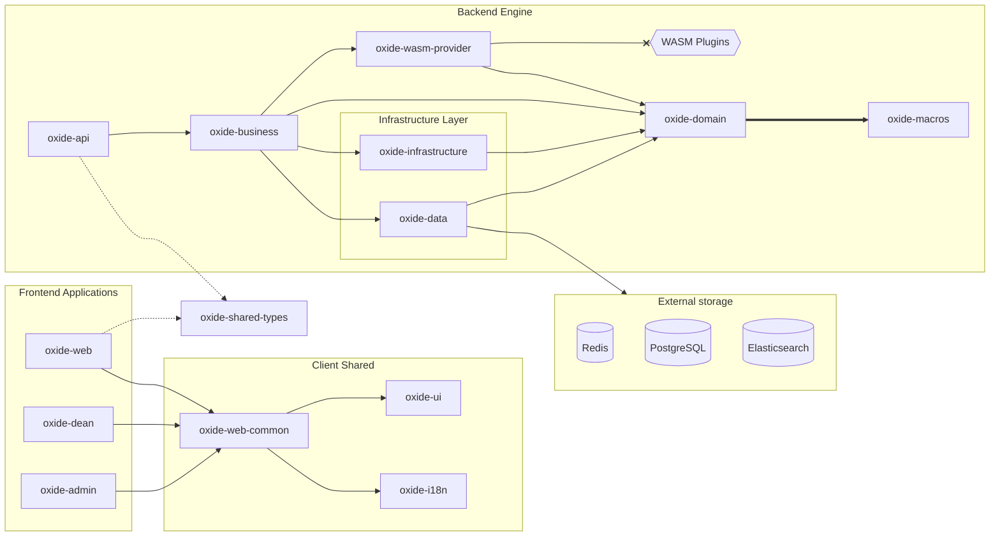

# 👋 Hello, I'm Denis
### System Architect & Rust Enthusiast 🦀

  
  
  
  

---

## 🚀 About Me

I build high-performance, resilient, and type-safe systems. My passion lies in **Modular Monoliths**, **Event-Driven Architecture**, and pushing the boundaries of what's possible with **Rust**.

- 🛠️ Currently architecting **[Oxide LMS](https://github.com/Vancoola/oxide-lms)** — a next-gen learning platform powered by Rust and sandboxed WASM plugins.
- 🏗️ Deeply interested in **Clean Architecture**, **Transactional Outbox patterns**, and **Zero-cost abstractions**.
- ⚡ Focus: Low-latency backends, secure sandboxing, and scalable database design.

---

## 🛠️ Engineering Toolkit

| Layer | Technologies |
| :--- | :--- |
| **Backend** | `Rust (Axum, Tokio, SQLx)`, `C#` |
| **Frontend** | `Leptos (WASM)`, `Tailwind CSS` |
| **Infrastructure** | `PostgreSQL`, `Redis`, `Docker`, `NATS` |
| **Extensibility** | `Wasmtime`, `WIT (Component Model)` |

---

## 📊 Project Showcase: Oxide LMS 🦀
*The core of my current research in modular systems.*

**Key architectural achievements:**
* **Sandboxed Plugins:** Executing untrusted code via Wasmtime with sub-millisecond overhead.
* **Guaranteed Event Delivery:** Custom Transactional Outbox implementation using Postgres `LISTEN/NOTIFY`.
* **Type-Safe Sync:** Shared DTOs between Leptos frontend and Axum backend for zero-overhead API contracts.

---

## 📫 Let's Connect

- 💼 LinkedIn: [linkedin.com/in/denis-suzdaltsev](https://linkedin.com/in/denis-suzdaltsev)
- 📧 Email: suzdaltsevdenis@icloud.com
- 🦀 Rustaceans are always welcome to open a PR or a Discussion in my repos!
